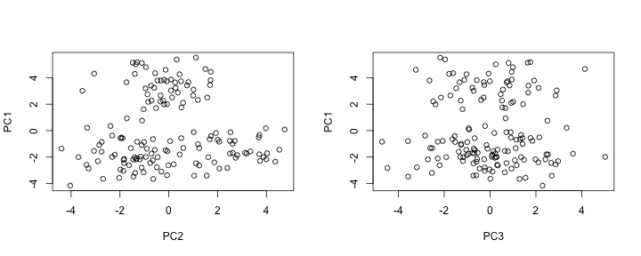
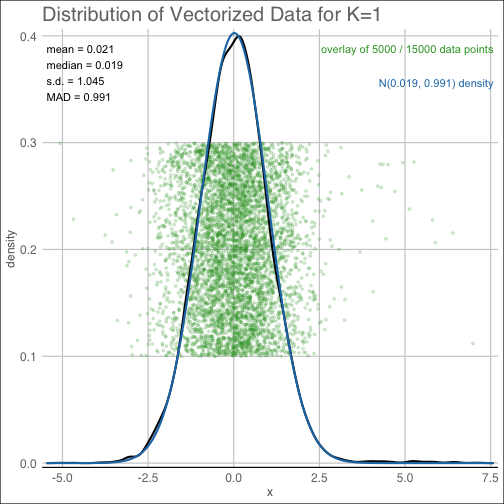
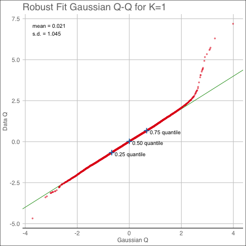
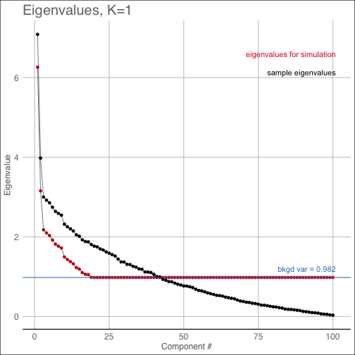
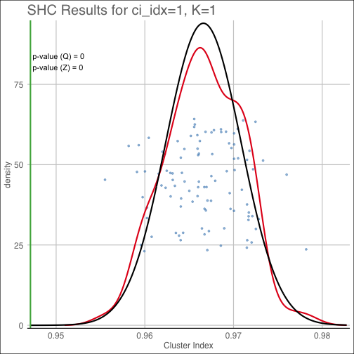

sigclust2 [](https://travis-ci.org/pkimes/sigclust2) [](https://codecov.io/gh/pkimes/sigclust2)
=======================

## Contents
1. [Introduction](#intro)
2. [Installing](#install)
3. [Testing](#test)
4. [Plotting](#plot)
5. [References](#refs)
6. [Session Information](#sessioninfo)


## <a name="intro"></a> Introduction

This package may be used to assess statistical significance in hierarchical clustering.
To assess significance in high-dimensional data, the approach assumes that a cluster
may be well approximated by a single Gaussian (normal) distribution. Given the results
of hierarchical clustering, the approach sequentially tests from the root node whether
the data at each split/join correspond to one or more Gaussian distributions. The
hypothesis test performed at each node is based on a Monte Carlo simulation procedure,
and the family-wise error rate (FWER) is controlled across the dendrogram using a sequential
testing procedure.  

An illustration of the basic usage of the package's testing procedure is provided in the
[Testing section](#test). Variations on the basic testing procedure are described in the
associated subsections. Basic plotting procedures are described in the [Plotting section](#plot).  

## <a name="install"></a> Installing

To install `sigclust2`, which depends on packages in both [CRAN](http://cran.r-project.org/) and [Bioconductor](https://bioconductor.org/),
use the following call to [the `BiocManager` package](https://CRAN.R-project.org/package=BiocManager):  

```
R> BiocManager::install("pkimes/sigclust2")
```

The package can then be loaded using the standard call to `library`.  


```r
suppressPackageStartupMessages(library("sigclust2"))
```

**While not necessary, installing the `Rclusterpp` package for faster clustering is recommended
when using `sigclust2`.** Unforunately, the `Rclusterpp` package is no longer available on CRAN.
However, `Rclusterpp` can still be installed from [the author's GitHub repo](https://github.com/nolanlab/Rclusterpp/)
with the following command from [the `devtools` package](https://CRAN.R-project.org/package=devtools) (or
equivalently with a call to `BiocManager::install` again).

```
R> devtools::install_github("nolanlab/Rclusterpp")
```

## <a name="test"></a> Testing

For the following examples, we will use a simple toy example with 150 samples (_n_) with
100 measurements (_p_). The data are simulated from three Gaussian (normal) distributions.  


```r
set.seed(1508)
n1 <- 60; n2 <- 40; n3 <- 50; n <- n1 + n2 + n3
p <- 100
data <- matrix(rnorm(n*p), nrow=n, ncol=p)
data[, 1] <- data[, 1] + c(rep(2, n1), rep(-2, n2), rep(0, n3))
data[, 2] <- data[, 2] + c(rep(0, n1+n2), rep(sqrt(3)*3, n3))
```
The separation of the three underlying distributions can be observed from a PCA (principal components
analysis) scatterplot. While the separation is clear in the first 2 PCs, recall that the data
actually exists in 100 dimensions.  


```r
data_pc <- prcomp(data)
par(mfrow=c(1, 2))
plot(data_pc$x[, 2], data_pc$x[, 1], xlab="PC2", ylab="PC1")
plot(data_pc$x[, 3], data_pc$x[, 1], xlab="PC3", ylab="PC1")
```



The SHC testing procedure is performed using the `shc` function. The function requires the following
three arguments:  

* `x`: the data as a `matrix` with samples in rows,  
* `metric`: the dissimilarity metric, and  
* `linkage`: the linkage function to be used for hierarchical clustering.  

For reasons outlined in the corresponding paper [(Kimes et al. 2017)](#refs) relating to how
the method handles testing when n << p, we recommmend using `"euclidean"` as the metric,
and any of `"ward.D2"`, `"single"`, `"average"`, `"complete"` as the linkage. If a custom
dissimilarity metric is desired, either of `vecmet` or `matmet` should be specified, as
described [later](#newmetric) in this section.  

If metric functions which do not statisfy rotation invariance are desired,
e.g. one minus Pearson correlation (`"cor"`) or L1 (`"manhattan"`),
`null_alg = "2means"` and `ci = "2CI"` should be specified. The `null_alg` and `ci` parameters
specify the algorithm for clustering and measure of "cluster strength" used to generate the null
distribution for assessing significance. Since the K-means algorithm (`2means`) optimizes
the 2-means CI (`2CI`), the resulting p-value will be conservative. However, since the hierarchical
algorithm is not rotation invariant, using `null_alg = "hclust"` or `ci = "linkage"` produces
unreliable results. An example for testing using Pearson correlation is given [later](#pearson) in
this section.  

For now, we just use the recommended and default parameters.  


```r
shc_result <- shc(data, metric="euclidean", linkage="ward.D2")
```

The output is a S3 object of class `shc`, and a brief description of the analysis results can be
obtained by the `summary` function.  


```r
summary(shc_result)
```

```
## 
## shc object created using shc(..)
## --------------------------------
## Clustering Parameters:
##     dissimilarity = euclidean
##     linkage = ward.D2
## Testing Parameters:
##     n_sim = 100
##     icovest = 1
##     ci = 2CI
##     null_alg = hclust
##     n_min = 10
##     FWER control = FALSE
```

The analysis output can be accessed using the `$` accessor. More details on the different entries
can be found in the documentation for the `shc` function.  


```r
names(shc_result)
```

```
##  [1] "in_mat"     "in_args"    "eigval_dat" "eigval_sim" "backvar"   
##  [6] "nd_type"    "ci_dat"     "ci_sim"     "p_emp"      "p_norm"    
## [11] "idx_hc"     "hc_dat"
```

The computed p-values are probably of greatest interest. Two p-values are computed as part of the
SHC testing procedure: (1) an empirical p-value (`p_emp`), and (2) a Gaussian approximate
p-value (`p_norm`). The p-values are computed based on comparing the observed strength of
clustering in the data against the expected strength of clustering under the null hypothesis
that the data from a single cluster. The null distribution is approximated using a
specified number of simulated datasets (`n_sim = 100` default argument). `p_emp` is the empirical
p-value computed from the collection of simulated null datasets. `p_norm` is an approximation to
the empirical p-value which provides more continuous p-values. `nd_type` stores the results of the
test and takes values in: `n_small`, `no_test`, `sig`, `not_sig`, `cutoff_skipped`. With the default
implementation of `shc` using no FWER control, all nodes are either `cutoff_skipped` or `n_small`.  

The p-values are reported for each of 149 (`n-1`) nodes along the hierarchical dendrogram.
The entries of `p_emp` and `p_norm` are ordered descending from the top of the dendrogram, with
the first entry corresponding to the very top (root) node of the tree.  


```r
data.frame(result = head(shc_result$nd_type, 5),
           round(head(shc_result$p_norm, 5), 5),
           round(head(shc_result$p_emp, 5), 5))
```

```
##           result hclust_2CI hclust_2CI.1
## 1 cutoff_skipped    0.00000         0.00
## 2 cutoff_skipped    0.41475         0.37
## 3 cutoff_skipped    0.88019         0.90
## 4 cutoff_skipped    0.84834         0.85
## 5 cutoff_skipped    0.86693         0.88
```

In addition to values between 0 and 1, some p-values are reported as `2`. These values correspond
to nodes which were not tested, either because of the implemented family-wise error rate (FWER)
controlling procedure (`alpha`) or the minimum tree size for testing (`min_n`).  

Variations on the standard testing procedure are possible by changing the default parameters of
the call to `shc(..)`.  


### <a name="newmetric"></a>Explicitly specifying a dissimilarity function
The method also supports specifying your own metric function through the `vecmet` and `matmet`
parameters. Only one of `vecmet` and `matmet` should be specified. If either is specified, the
`metric` parameter will be ignored. The `vecmet` parameter should be passed a function which takes
two vectors as input and returns the dissimilarity between the two vectors. The `matmet` parameter
should be passed a function which takes a matrix as input and returns a `dist` object of
dissimilarities of the matrix rows.  

The `vecmet` example is not actually run in this tutorial since it is __incredibliy__
computationally expensive. Internally, the function passed to `vecmet` is wrapped in the
following call to `outer` to compute dissimilarities between all rows of a matrix.  


```r
as.dist(outer(split(x, row(x)), split(x, row(x)), Vectorize(vecmet)))
```

The following simple benchmarking example with `cor` illustrates the overhead for
using `outer` to call on a vector function rather than using an optimized matrix
dissimilarity function.


```r
vfun <- function(x, y) {1 - cor(x, y)}
mfun1 <- function(x) {
    as.dist(outer(split(x, row(x)), split(x, row(x)),
                  Vectorize(vfun)))
}
mfun2 <- function(x) { as.dist(1 - cor(t(x))) }

system.time(mfun1(data))
```

```
##    user  system elapsed 
##   1.884   0.053   1.997
```

```r
system.time(mfun2(data))
```

```
##    user  system elapsed 
##   0.001   0.000   0.002
```

The first matrix correlation function, `mfun1`, is written it
would be processed if `vfun` were passed to `shc` as `vecmet`. The second funtion,
`mfun2`, is a function that could be passed to `matmet`. The performance difference is
clearly significant.  

When specifying a custom dissimilarity function for `shc`, it is important to
remember that the function must be used to compute dissimilarity matrices `n_sim` times
for __each node__. In our toy example where `n_sim = 100` and `n = 150`, this means
calling on the dissimilarity function >10,000 times.  

Our custom function, `mfun2` can be passed to `shc` through the `matmet` parameter.  


```r
shc_mfun2 <- shc(data, matmet=mfun2, linkage="average")

data.frame(result = head(shc_mfun2$nd_type),
           round(head(shc_mfun2$p_norm), 5),
           round(head(shc_mfun2$p_emp), 5))
```

```
##           result hclust_2CI hclust_2CI.1
## 1 cutoff_skipped    0.99845         1.00
## 2 cutoff_skipped    0.63709         0.69
## 3 cutoff_skipped    0.24079         0.24
## 4 cutoff_skipped    0.94164         0.94
## 5 cutoff_skipped    0.94411         0.96
## 6 cutoff_skipped    0.99639         1.00
```

Since the toy dataset is simulated with all differentiating signal lying in the
first two dimensions, Pearson correlation-based clustering does a poor job at
distinguishing the clusters, and the resulting p-values show weak significance.  


### <a name="pearson"></a> Using Pearson correlation
As a shortcut, without having to specify `matmet`, if testing using `(1 - cor(x))` is desired,
the following specification can be used.  


```r
data_pearson <- shc(data, metric="cor", linkage="average", null_alg="2means")
```

The result will be equivalent to apply the original `sigclust` hypothesis test described
in [Liu et al. 2008](#refs) at each node along the dendrogram.  


### <a name="fwerstopping"></a> Testing with FWER stopping
By default, p-values are calculated at all nodes along the dendrogram with at least `n_min`
observations (default `n_min = 10`). The package includes a FWER controlling procedure which
proceeds sequentially from the top node such that daughter nodes are only tested if 
FWER-corrected significance was achieved at the parent node. To reduce the total number of tests
performed, set `alpha` to some value less than `1`.   


```r
shc_fwer <- shc(data, metric="euclidean", linkage="ward.D2", alpha=0.05)
```

The FWER is noted in the summary of the resulting `shc` object, and can be seen in the `nd_type`
attribute, where most tests are now labeled `no_test` (with `p_norm` and `p_emp` values of 2).  


```r
data.frame(result = head(shc_fwer$nd_type, 10),
           round(head(shc_fwer$p_norm, 10), 5),
           round(head(shc_fwer$p_emp, 10), 5))
```

```
##     result hclust_2CI hclust_2CI.1
## 1      sig    0.00000         0.00
## 2  not_sig    0.36017         0.27
## 3  no_test    2.00000         2.00
## 4  not_sig    0.86606         0.88
## 5  no_test    2.00000         2.00
## 6  no_test    2.00000         2.00
## 7  no_test    2.00000         2.00
## 8  no_test    2.00000         2.00
## 9  no_test    2.00000         2.00
## 10 no_test    2.00000         2.00
```

By default, `p_norm` p-values are used to test for significance against the FWER cutoffs,
but `p_emp` can be used by specifying `p_emp = TRUE`.  


### <a name="pearson"></a> Performing tests with multiple indices
The `shc` function allows for testing along the same dendrogram simultaneously using
different measures of strength of clustering.  

For example, it is possible to simultaneously test the above example using both the 2-means
cluster index and the linkage value as the measure of strength of clustering.  


```r
data_2tests <- shc(data, metric="euclidean", linkage="ward.D2",
                   ci=c("2CI", "linkage"),
                   null_alg=c("hclust", "hclust"))
round(head(data_2tests$p_norm), 5)
```

```
##      hclust_2CI hclust_linkage
## [1,]    0.00001        0.00152
## [2,]    0.42544        0.97613
## [3,]    0.83015        0.99999
## [4,]    0.86116        1.00000
## [5,]    0.81640        1.00000
## [6,]    0.98948        1.00000
```

The results of clustering using `hclust_2CI` and `hclust_linkage` are reported in the columns
of the analysis results. The relative performance of a few of these different combinations are
described in the [corresponding manuscript](#refs) when using Ward's linkage clustering.
When `alpha < 1` is specified, the additional `ci_idx` parameter specifies the index of the test
that should be used when trying to control the FWER.  


## <a name="plot"></a> Plotting

While looking at the p-values is nice, plots are always nicer than numbers. A nice way to
see the results of the SHC procedure is simply to call `plot` on the `shc` class object
created using the `shc(..)` constructor. 


```r
plot(shc_result, hang=.1)
```


The resulting plot shows significant nodes and splits in red, as well as the corresponding p-values.
Nodes which were not tested, as described earlier, are marked in either green or teal (blue).  

### <a name="diagnostics"></a> Diagnostic plots

Several types of diagnostic plots are implemented for the SHC method. These are available through the
`diagnostic` method. Since testing is performed separately at each node along the dendrogram, diagnostic
plots are also generated per-node. The set of nodes for which diagnostic plots should be generated
is specified with the `K` parameter. The default is to only generate plots for the root node, `K = 1`.  

The method currently supports four types of diagnostic plots: `background`, `qq`, `covest`, `pvalue`.
The desired plot type is specified to the `pty` parameter as a vector of strings. To create all four
plots, simply specify `all`, which is also the default value.  

If the length of `K` is greater than 1 or more than one plot type is specified, the method will
write files to a pdf file, `fname.pdf`, where `fname` is an input parameter that can be specifeid
by the user.  

The `background` plot will return a jitter plot of the matrix entries, as well as a smooth kernel
density estimate and best-fit Gaussian approximation used in estimating the background
noise level. 


```r
diagnostic(shc_result, K=1, pty='background')
```



The `qq` plot provides the corresponding Quantile-Quantile plot from the background noise estimating
procedure.


```r
diagnostic(shc_result, K=1, pty='qq')
```



The `covest` plot shows the estimated eigenvalues of the null Gaussian distribution along with the sample
eigenvalues of the original data matrix.


```r
diagnostic(shc_result, K=1, pty='covest')
```



The `pvalue` plot shows the cluster index for the original data along with the distribution of
simulated cluster indices used to determine the reported empirical (Q) p-value. Additionally, the
best-fit Gaussian approximation to the cluster index distirbution used to compute the Gaussian-approximate
(Z) p-value is overlaid in black.


```r
diagnostic(shc_result, K=1, pty='pvalue')
```




## <a name="refs"></a> References

* ___Kimes PK___, Liu Y, Hayes DN, and Marron JS. (2017). "Statistical significance 
for hierarchical clustering." _Biometrics_.
* Huang H, Liu Y, Yuan M, and Marron JS. (2015). "Statistical significance of 
clustering using soft thresholding."
_Journal of Computational and Graphical Statistics_.
* Liu Y, Hayes DN, Nobel A, and Marron JS. (2008). "Statistical significance of 
clustering for high-dimension, low–sample size data." 
_Journal of the American Statistical Association_.


## <a name="sessioninfo"></a> Session Information


```r
sessionInfo()
```

```
## R version 3.5.0 (2018-04-23)
## Platform: x86_64-apple-darwin15.6.0 (64-bit)
## Running under: OS X El Capitan 10.11.6
## 
## Matrix products: default
## BLAS/LAPACK: /usr/local/Cellar/openblas/0.2.20_2/lib/libopenblasp-r0.2.20.dylib
## 
## locale:
## [1] en_US.UTF-8/en_US.UTF-8/en_US.UTF-8/C/en_US.UTF-8/en_US.UTF-8
## 
## attached base packages:
## [1] stats     graphics  grDevices utils     datasets  methods   base     
## 
## other attached packages:
## [1] sigclust2_1.2.4 bindrcpp_0.2.2  testthat_2.0.0  Rcpp_1.0.0     
## [5] GGally_1.4.0    ggplot2_3.1.0  
## 
## loaded via a namespace (and not attached):
##   [1] matrixStats_0.54.0    fs_1.2.6              usethis_1.4.0        
##   [4] fit.models_0.5-14     robust_0.4-18         devtools_2.0.0.9000  
##   [7] bit64_0.9-7           doParallel_1.0.14     RColorBrewer_1.1-2   
##  [10] rprojroot_1.3-2       dynamicTreeCut_1.63-1 tools_3.5.0          
##  [13] backports_1.1.2       R6_2.3.0              rpart_4.1-13         
##  [16] Hmisc_4.1-1           DBI_1.0.0             lazyeval_0.2.1       
##  [19] BiocGenerics_0.26.0   colorspace_1.3-2      nnet_7.3-12          
##  [22] withr_2.1.2           tidyselect_0.2.5      gridExtra_2.3        
##  [25] prettyunits_1.0.2     processx_3.2.0        preprocessCore_1.42.0
##  [28] bit_1.1-14            compiler_3.5.0        WGCNA_1.66           
##  [31] cli_1.0.1             Biobase_2.40.0        htmlTable_1.12       
##  [34] ggdendro_0.1-20       desc_1.2.0            labeling_0.3         
##  [37] scales_1.0.0          checkmate_1.8.5       mvtnorm_1.0-8        
##  [40] DEoptimR_1.0-8        robustbase_0.93-3     callr_3.0.0          
##  [43] stringr_1.3.1         digest_0.6.18         foreign_0.8-71       
##  [46] rmarkdown_1.10        rrcov_1.4-4           base64enc_0.1-3      
##  [49] pkgconfig_2.0.2       htmltools_0.3.6       sessioninfo_1.1.1    
##  [52] highr_0.7             ggthemes_4.0.1        htmlwidgets_1.3      
##  [55] rlang_0.3.0.9000      rstudioapi_0.8        RSQLite_2.1.1        
##  [58] impute_1.54.0         bindr_0.1.1           acepack_1.4.1        
##  [61] dplyr_0.7.7           magrittr_1.5          GO.db_3.6.0          
##  [64] Formula_1.2-3         Matrix_1.2-14         munsell_0.5.0        
##  [67] S4Vectors_0.18.3      stringi_1.2.4         MASS_7.3-50          
##  [70] debugme_1.1.0         pkgbuild_1.0.2.9000   plyr_1.8.4           
##  [73] grid_3.5.0            blob_1.1.1            parallel_3.5.0       
##  [76] crayon_1.3.4          lattice_0.20-35       splines_3.5.0        
##  [79] knitr_1.20            ps_1.2.0              pillar_1.3.0         
##  [82] fastcluster_1.1.25    codetools_0.2-15      stats4_3.5.0         
##  [85] pkgload_1.0.1.9000    glue_1.3.0            evaluate_0.12        
##  [88] latticeExtra_0.6-28   data.table_1.11.8     remotes_2.0.1        
##  [91] foreach_1.4.4         gtable_0.2.0          purrr_0.2.5          
##  [94] reshape_0.8.7         assertthat_0.2.0      pcaPP_1.9-73         
##  [97] survival_2.42-6       tibble_1.4.2          iterators_1.0.10     
## [100] AnnotationDbi_1.42.1 
##  [ reached getOption("max.print") -- omitted 3 entries ]
```
